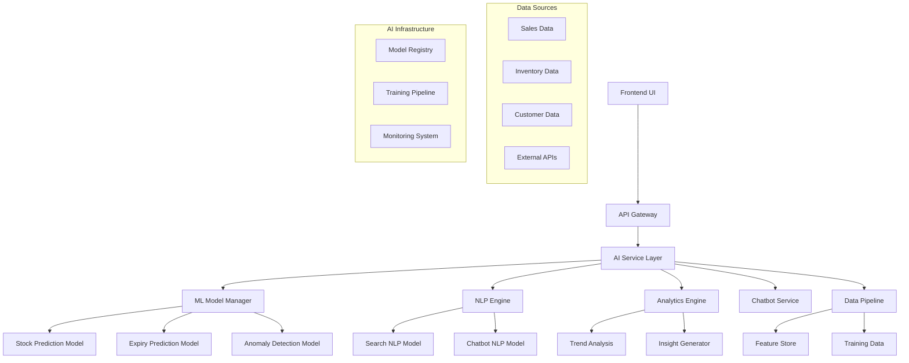

# AI & Smart Assistance System - Design Document

## Overview

This design document outlines the technical architecture for implementing AI-powered smart assistance features in the pharmacy management system. The solution leverages machine learning, natural language processing, and predictive analytics to provide intelligent automation and enhanced user experience.

## Architecture

### High-Level Architecture



### Technology Stack

- **Backend Framework**: Laravel 12.x with AI service integration
- **Machine Learning**: Python with scikit-learn, TensorFlow/PyTorch
- **NLP Processing**: spaCy, Transformers (Hugging Face)
- **Data Pipeline**: Apache Airflow or Laravel Queues
- **Model Serving**: Flask/FastAPI microservices
- **Database**: PostgreSQL/MySQL with vector extensions
- **Caching**: Redis for model predictions and NLP results
- **Message Queue**: Redis/RabbitMQ for async processing

## Components and Interfaces

### 1. AI Service Layer

#### Core AI Services
```php
// AI Service Interface
interface AIServiceInterface
{
    public function predict(array $data): array;
    public function train(array $trainingData): bool;
    public function evaluate(): array;
    public function getModelInfo(): array;
}

// Stock Prediction Service
class StockPredictionService implements AIServiceInterface
{
    public function predictDemand(int $medicineId, int $days): array;
    public function getReorderRecommendations(): array;
    public function analyzeSeasonalTrends(int $medicineId): array;
}

// Expiry Prediction Service
class ExpiryPredictionService implements AIServiceInterface
{
    public function predictExpiryRisk(int $medicineId): array;
    public function getExpiryAlerts(): array;
    public function suggestPromotions(): array;
}

// Anomaly Detection Service
class AnomalyDetectionService implements AIServiceInterface
{
    public function detectSalesAnomalies(array $salesData): array;
    public function validatePrescription(array $prescriptionData): array;
    public function analyzeCustomerBehavior(int $customerId): array;
}
```

### 2. NLP Engine

#### Natural Language Processing Components
```php
// NLP Service for Smart Search
class NLPSearchService
{
    public function searchBySymptoms(string $query): array;
    public function extractMedicalEntities(string $text): array;
    public function rankMedicineRelevance(string $query, array $medicines): array;
    public function generateSearchExplanation(string $query, array $results): string;
}

// Chatbot Service
class ChatbotService
{
    public function processMessage(string $message, array $context): array;
    public function generateResponse(string $intent, array $entities): string;
    public function escalateToHuman(string $reason): bool;
    public function learnFromFeedback(string $messageId, bool $helpful): void;
}
```

### 3. Analytics Engine

#### AI-Powered Analytics
```php
// Analytics Service
class AIAnalyticsService
{
    public function generateInsights(array $filters): array;
    public function detectTrends(string $metric, array $timeRange): array;
    public function predictBusinessMetrics(int $days): array;
    public function generateRecommendations(): array;
}

// Insight Generator
class InsightGenerator
{
    public function analyzeSalesTrends(): array;
    public function identifyGrowthOpportunities(): array;
    public function detectPerformanceIssues(): array;
    public function generateNaturalLanguageInsights(array $data): string;
}
```

## Data Models

### 1. AI Prediction Models

```php
// Stock Prediction Model
class StockPrediction extends Model
{
    protected $fillable = [
        'medicine_id',
        'prediction_date',
        'predicted_demand',
        'confidence_score',
        'prediction_horizon',
        'model_version',
        'actual_demand',
        'accuracy_score'
    ];
    
    protected $casts = [
        'prediction_date' => 'date',
        'predicted_demand' => 'decimal:2',
        'confidence_score' => 'decimal:4',
        'accuracy_score' => 'decimal:4'
    ];
}

// Expiry Alert Model
class ExpiryAlert extends Model
{
    protected $fillable = [
        'medicine_id',
        'batch_id',
        'expiry_date',
        'alert_date',
        'risk_score',
        'recommended_action',
        'status',
        'resolved_at'
    ];
    
    protected $casts = [
        'expiry_date' => 'date',
        'alert_date' => 'date',
        'risk_score' => 'decimal:4',
        'resolved_at' => 'datetime'
    ];
}

// Anomaly Detection Model
class AnomalyDetection extends Model
{
    protected $fillable = [
        'transaction_id',
        'anomaly_type',
        'risk_score',
        'description',
        'detected_at',
        'status',
        'reviewed_by',
        'resolution_notes'
    ];
    
    protected $casts = [
        'risk_score' => 'decimal:4',
        'detected_at' => 'datetime'
    ];
}
```

### 2. NLP and Search Models

```php
// Search Query Model
class SearchQuery extends Model
{
    protected $fillable = [
        'user_id',
        'query_text',
        'search_type',
        'results_count',
        'clicked_result',
        'satisfaction_score',
        'processing_time'
    ];
    
    protected $casts = [
        'satisfaction_score' => 'decimal:2',
        'processing_time' => 'decimal:4'
    ];
}

// Chatbot Conversation Model
class ChatbotConversation extends Model
{
    protected $fillable = [
        'user_id',
        'session_id',
        'message',
        'response',
        'intent',
        'confidence_score',
        'escalated',
        'helpful'
    ];
    
    protected $casts = [
        'confidence_score' => 'decimal:4',
        'escalated' => 'boolean',
        'helpful' => 'boolean'
    ];
}
```

### 3. AI Model Management

```php
// ML Model Registry
class MLModel extends Model
{
    protected $fillable = [
        'name',
        'version',
        'type',
        'status',
        'accuracy_metrics',
        'training_data_size',
        'deployed_at',
        'model_path',
        'hyperparameters'
    ];
    
    protected $casts = [
        'accuracy_metrics' => 'array',
        'hyperparameters' => 'array',
        'deployed_at' => 'datetime'
    ];
}
```

## AI Model Architecture

### 1. Stock Prediction Model

**Algorithm**: Time Series Forecasting with LSTM/Prophet
```python
# Stock Prediction Model Structure
class StockPredictionModel:
    def __init__(self):
        self.model = Prophet(
            yearly_seasonality=True,
            weekly_seasonality=True,
            daily_seasonality=False
        )
        
    def prepare_features(self, sales_data):
        # Feature engineering
        features = {
            'ds': sales_data['date'],
            'y': sales_data['quantity'],
            'holiday': self.get_holidays(),
            'promotion': sales_data['promotion_active'],
            'weather': self.get_weather_data(),
            'epidemic_factor': self.get_epidemic_data()
        }
        return features
        
    def train(self, historical_data):
        features = self.prepare_features(historical_data)
        self.model.fit(features)
        
    def predict(self, days_ahead):
        future = self.model.make_future_dataframe(periods=days_ahead)
        forecast = self.model.predict(future)
        return forecast
```

### 2. Expiry Prediction Model

**Algorithm**: Classification with Random Forest/XGBoost
```python
class ExpiryPredictionModel:
    def __init__(self):
        self.model = XGBClassifier(
            n_estimators=100,
            max_depth=6,
            learning_rate=0.1
        )
        
    def prepare_features(self, medicine_data):
        features = {
            'days_to_expiry': medicine_data['days_to_expiry'],
            'current_stock': medicine_data['stock'],
            'avg_daily_sales': medicine_data['avg_sales'],
            'seasonal_factor': medicine_data['seasonal_factor'],
            'price_category': medicine_data['price_category'],
            'medicine_category': medicine_data['category']
        }
        return features
        
    def predict_expiry_risk(self, medicine_data):
        features = self.prepare_features(medicine_data)
        risk_score = self.model.predict_proba(features)
        return risk_score
```

### 3. NLP Search Model

**Algorithm**: Semantic Search with Sentence Transformers
```python
class MedicalNLPSearch:
    def __init__(self):
        self.model = SentenceTransformer('all-MiniLM-L6-v2')
        self.medical_ner = spacy.load('en_core_sci_sm')
        
    def encode_medicines(self, medicines):
        # Create embeddings for medicine descriptions
        descriptions = [f"{med['name']} {med['description']} {med['uses']}" 
                      for med in medicines]
        embeddings = self.model.encode(descriptions)
        return embeddings
        
    def search_by_symptoms(self, query, medicine_embeddings):
        # Extract medical entities
        entities = self.extract_medical_entities(query)
        
        # Create query embedding
        query_embedding = self.model.encode([query])
        
        # Calculate similarity
        similarities = cosine_similarity(query_embedding, medicine_embeddings)
        
        return similarities
```

## Database Schema

### AI-Specific Tables
```sql
-- Stock Predictions Table
CREATE TABLE stock_predictions (
    id BIGINT PRIMARY KEY AUTO_INCREMENT,
    medicine_id BIGINT NOT NULL,
    prediction_date DATE NOT NULL,
    predicted_demand DECIMAL(10,2) NOT NULL,
    confidence_score DECIMAL(5,4) NOT NULL,
    prediction_horizon INT NOT NULL,
    model_version VARCHAR(50) NOT NULL,
    actual_demand DECIMAL(10,2) NULL,
    accuracy_score DECIMAL(5,4) NULL,
    created_at TIMESTAMP DEFAULT CURRENT_TIMESTAMP,
    updated_at TIMESTAMP DEFAULT CURRENT_TIMESTAMP ON UPDATE CURRENT_TIMESTAMP,
    
    INDEX idx_medicine_date (medicine_id, prediction_date),
    INDEX idx_prediction_date (prediction_date),
    FOREIGN KEY (medicine_id) REFERENCES medicines(id)
);

-- Expiry Alerts Table
CREATE TABLE expiry_alerts (
    id BIGINT PRIMARY KEY AUTO_INCREMENT,
    medicine_id BIGINT NOT NULL,
    batch_number VARCHAR(100),
    expiry_date DATE NOT NULL,
    alert_date DATE NOT NULL,
    risk_score DECIMAL(5,4) NOT NULL,
    recommended_action TEXT,
    status ENUM('pending', 'acknowledged', 'resolved') DEFAULT 'pending',
    resolved_at TIMESTAMP NULL,
    created_at TIMESTAMP DEFAULT CURRENT_TIMESTAMP,
    updated_at TIMESTAMP DEFAULT CURRENT_TIMESTAMP ON UPDATE CURRENT_TIMESTAMP,
    
    INDEX idx_medicine_expiry (medicine_id, expiry_date),
    INDEX idx_alert_date (alert_date),
    INDEX idx_status (status),
    FOREIGN KEY (medicine_id) REFERENCES medicines(id)
);

-- Anomaly Detections Table
CREATE TABLE anomaly_detections (
    id BIGINT PRIMARY KEY AUTO_INCREMENT,
    transaction_type ENUM('sale', 'purchase', 'prescription') NOT NULL,
    transaction_id BIGINT NOT NULL,
    anomaly_type VARCHAR(100) NOT NULL,
    risk_score DECIMAL(5,4) NOT NULL,
    description TEXT NOT NULL,
    detected_at TIMESTAMP DEFAULT CURRENT_TIMESTAMP,
    status ENUM('pending', 'investigating', 'resolved', 'false_positive') DEFAULT 'pending',
    reviewed_by BIGINT NULL,
    resolution_notes TEXT NULL,
    
    INDEX idx_transaction (transaction_type, transaction_id),
    INDEX idx_detected_date (detected_at),
    INDEX idx_status (status),
    INDEX idx_risk_score (risk_score),
    FOREIGN KEY (reviewed_by) REFERENCES users(id)
);

-- ML Models Registry
CREATE TABLE ml_models (
    id BIGINT PRIMARY KEY AUTO_INCREMENT,
    name VARCHAR(100) NOT NULL,
    version VARCHAR(50) NOT NULL,
    type ENUM('stock_prediction', 'expiry_prediction', 'anomaly_detection', 'nlp_search', 'chatbot') NOT NULL,
    status ENUM('training', 'deployed', 'deprecated') DEFAULT 'training',
    accuracy_metrics JSON,
    training_data_size INT,
    deployed_at TIMESTAMP NULL,
    model_path VARCHAR(500),
    hyperparameters JSON,
    created_at TIMESTAMP DEFAULT CURRENT_TIMESTAMP,
    updated_at TIMESTAMP DEFAULT CURRENT_TIMESTAMP ON UPDATE CURRENT_TIMESTAMP,
    
    UNIQUE KEY unique_model_version (name, version),
    INDEX idx_type_status (type, status)
);

-- Search Queries Table
CREATE TABLE search_queries (
    id BIGINT PRIMARY KEY AUTO_INCREMENT,
    user_id BIGINT NOT NULL,
    query_text TEXT NOT NULL,
    search_type ENUM('symptom', 'medicine_name', 'category') NOT NULL,
    results_count INT NOT NULL,
    clicked_result_id BIGINT NULL,
    satisfaction_score DECIMAL(3,2) NULL,
    processing_time DECIMAL(6,4) NOT NULL,
    created_at TIMESTAMP DEFAULT CURRENT_TIMESTAMP,
    
    INDEX idx_user_date (user_id, created_at),
    INDEX idx_search_type (search_type),
    FOREIGN KEY (user_id) REFERENCES users(id)
);

-- Chatbot Conversations Table
CREATE TABLE chatbot_conversations (
    id BIGINT PRIMARY KEY AUTO_INCREMENT,
    user_id BIGINT NOT NULL,
    session_id VARCHAR(100) NOT NULL,
    message TEXT NOT NULL,
    response TEXT NOT NULL,
    intent VARCHAR(100),
    confidence_score DECIMAL(5,4),
    escalated BOOLEAN DEFAULT FALSE,
    helpful BOOLEAN NULL,
    created_at TIMESTAMP DEFAULT CURRENT_TIMESTAMP,
    
    INDEX idx_user_session (user_id, session_id),
    INDEX idx_created_date (created_at),
    INDEX idx_intent (intent),
    FOREIGN KEY (user_id) REFERENCES users(id)
);
```

## API Design

### AI Service Endpoints
```php
// Stock Prediction API
Route::middleware(['auth', 'permission:view_reports'])->group(function () {
    Route::get('/api/ai/stock-predictions/{medicine}', [AIController::class, 'getStockPrediction']);
    Route::get('/api/ai/reorder-recommendations', [AIController::class, 'getReorderRecommendations']);
    Route::post('/api/ai/retrain-stock-model', [AIController::class, 'retrainStockModel']);
});

// Expiry Prediction API
Route::middleware(['auth', 'permission:manage_medicines'])->group(function () {
    Route::get('/api/ai/expiry-alerts', [AIController::class, 'getExpiryAlerts']);
    Route::post('/api/ai/expiry-alerts/{alert}/acknowledge', [AIController::class, 'acknowledgeExpiryAlert']);
    Route::get('/api/ai/expiry-predictions/{medicine}', [AIController::class, 'getExpiryPrediction']);
});

// Smart Search API
Route::middleware(['auth'])->group(function () {
    Route::post('/api/ai/search', [AIController::class, 'smartSearch']);
    Route::post('/api/ai/search/feedback', [AIController::class, 'searchFeedback']);
});

// Chatbot API
Route::middleware(['auth'])->group(function () {
    Route::post('/api/ai/chatbot/message', [ChatbotController::class, 'processMessage']);
    Route::post('/api/ai/chatbot/feedback', [ChatbotController::class, 'provideFeedback']);
    Route::get('/api/ai/chatbot/history', [ChatbotController::class, 'getConversationHistory']);
});

// Anomaly Detection API
Route::middleware(['auth', 'permission:view_audit_logs'])->group(function () {
    Route::get('/api/ai/anomalies', [AIController::class, 'getAnomalies']);
    Route::post('/api/ai/anomalies/{anomaly}/review', [AIController::class, 'reviewAnomaly']);
    Route::get('/api/ai/anomaly-dashboard', [AIController::class, 'getAnomalyDashboard']);
});
```

## Performance Considerations

### Model Serving Optimization
- **Model Caching**: Cache frequently used model predictions in Redis
- **Batch Processing**: Process multiple predictions in batches for efficiency
- **Async Processing**: Use queues for non-real-time predictions
- **Model Versioning**: Support A/B testing and gradual rollouts

### Data Pipeline Optimization
- **Feature Caching**: Cache computed features to avoid recomputation
- **Incremental Training**: Update models with new data incrementally
- **Data Sampling**: Use representative samples for faster training
- **Parallel Processing**: Distribute training across multiple workers

### API Performance
- **Response Caching**: Cache API responses for repeated queries
- **Rate Limiting**: Implement rate limiting for AI endpoints
- **Pagination**: Paginate large result sets
- **Compression**: Compress API responses to reduce bandwidth

## Security and Privacy

### Data Protection
- **Data Anonymization**: Remove PII from training data
- **Encryption**: Encrypt sensitive model data at rest and in transit
- **Access Control**: Implement role-based access to AI features
- **Audit Logging**: Log all AI system interactions

### Model Security
- **Model Validation**: Validate model inputs and outputs
- **Adversarial Protection**: Implement safeguards against adversarial attacks
- **Model Monitoring**: Monitor for model drift and performance degradation
- **Secure Deployment**: Use secure channels for model deployment

### Compliance
- **GDPR Compliance**: Implement right to explanation and data deletion
- **HIPAA Compliance**: Ensure medical data handling meets healthcare standards
- **Regulatory Reporting**: Generate compliance reports for AI decisions
- **Ethical AI**: Implement fairness and bias detection mechanisms