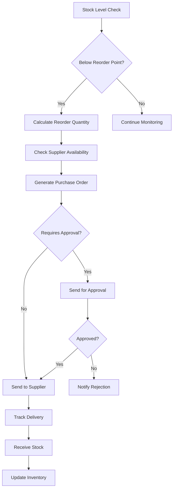
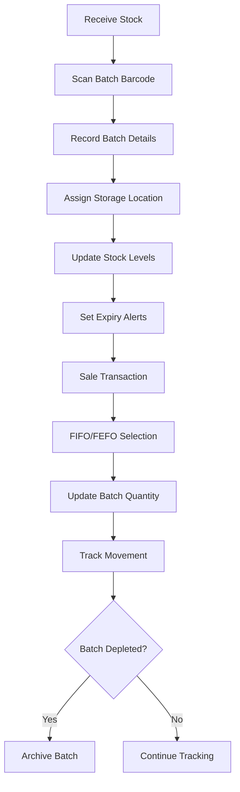

# Inventory & Stock Enhancements - System Design

## 🏗️ Architecture Overview

### System Components
```
┌─────────────────┐    ┌─────────────────┐    ┌─────────────────┐
│   Frontend UI   │    │  Laravel API    │    │   Database      │
│                 │    │                 │    │                 │
│ • Inventory     │◄──►│ • Controllers   │◄──►│ • Enhanced      │
│   Dashboard     │    │ • Services      │    │   Schema        │
│ • Mobile App    │    │ • Models        │    │ • Batch         │
│ • Barcode       │    │ • Jobs/Queues   │    │   Tracking      │
│   Scanner       │    │                 │    │ • Multi-unit    │
└─────────────────┘    └─────────────────┘    └─────────────────┘
         │                       │                       │
         │              ┌─────────────────┐              │
         │              │  External APIs  │              │
         └──────────────►│                 │◄─────────────┘
                        │ • Supplier EDI  │
                        │ • Barcode APIs  │
                        │ • Mobile Sync   │
                        └─────────────────┘
```

## 📊 Database Schema Design

### Enhanced Medicine Table
```sql
ALTER TABLE medicines ADD COLUMN (
    -- Unit Management
    base_unit VARCHAR(50) DEFAULT 'tablet',
    unit_conversions JSON, -- {"strip": 10, "box": 100}
    
    -- Reorder Settings
    reorder_point INT DEFAULT 50,
    reorder_quantity INT DEFAULT 100,
    safety_stock INT DEFAULT 20,
    lead_time_days INT DEFAULT 7,
    
    -- Tracking
    track_batches BOOLEAN DEFAULT true,
    require_expiry BOOLEAN DEFAULT true,
    barcode VARCHAR(255),
    qr_code TEXT
);
```

### New Tables Structure
```sql
-- Warehouses and Branches
warehouses (id, name, code, address, type, is_active)
branches (id, warehouse_id, name, code, manager_id)

-- Batch and Lot Tracking
batches (id, medicine_id, batch_number, lot_number, 
         expiry_date, manufacture_date, supplier_id,
         purchase_price, selling_price, quantity_received)

-- Stock Management
stock_levels (id, medicine_id, warehouse_id, batch_id,
              quantity, reserved_quantity, unit_type,
              last_updated, audit_status)

-- Purchase Orders
purchase_orders (id, supplier_id, warehouse_id, status,
                 order_date, expected_date, total_amount,
                 created_by, approved_by)

purchase_order_items (id, purchase_order_id, medicine_id,
                      quantity, unit_price, total_price,
                      received_quantity, batch_id)

-- Stock Movements
stock_movements (id, medicine_id, warehouse_id, batch_id,
                 movement_type, quantity, unit_type,
                 reference_type, reference_id, notes,
                 created_by, created_at)

-- Reorder Rules
reorder_rules (id, medicine_id, warehouse_id, min_stock,
               max_stock, reorder_point, reorder_quantity,
               supplier_id, is_active)

-- Mobile Audits
stock_audits (id, warehouse_id, audit_date, status,
              auditor_id, total_items, discrepancies,
              notes, completed_at)

stock_audit_items (id, audit_id, medicine_id, batch_id,
                   expected_quantity, actual_quantity,
                   variance, unit_type, notes, photo_path)

-- Barcode Mappings
barcodes (id, code, type, medicine_id, batch_id,
          unit_type, quantity_per_scan, is_active)
```

## 🔧 Service Layer Architecture

### Core Services
```php
// Inventory Management
InventoryService
├── StockLevelService
├── BatchTrackingService
├── ReorderService
├── WarehouseService
└── UnitConversionService

// Purchase Order Management
PurchaseOrderService
├── SupplierIntegrationService
├── OrderGenerationService
├── ReceivingService
└── InvoiceMatchingService

// Mobile and Scanning
MobileAuditService
├── BarcodeService
├── QRCodeService
├── PhotoService
└── SyncService

// Analytics and Reporting
InventoryAnalyticsService
├── ProfitLossService
├── TurnoverAnalysisService
├── ExpiryTrackingService
└── PerformanceMetricsService
```

## 📱 Frontend Component Structure

### Main Dashboard Components
```jsx
InventoryDashboard/
├── StockOverview/
│   ├── StockLevelCards
│   ├── LowStockAlerts
│   └── ExpiryWarnings
├── BatchManagement/
│   ├── BatchList
│   ├── BatchDetails
│   └── ExpiryCalendar
├── PurchaseOrders/
│   ├── OrderList
│   ├── OrderForm
│   └── ReceivingInterface
├── Warehouses/
│   ├── WarehouseList
│   ├── StockTransfers
│   └── BranchManagement
└── Analytics/
    ├── ProfitLossCharts
    ├── TurnoverReports
    └── PerformanceMetrics
```

### Mobile Components
```jsx
MobileAudit/
├── ScannerInterface/
│   ├── BarcodeScanner
│   ├── QRScanner
│   └── ManualEntry
├── AuditWorkflow/
│   ├── ItemList
│   ├── CountingInterface
│   └── DiscrepancyReporting
├── PhotoCapture/
│   ├── CameraInterface
│   ├── PhotoGallery
│   └── AnnotationTools
└── SyncManager/
    ├── OfflineStorage
    ├── DataSync
    └── ConflictResolution
```

## 🔄 Business Logic Flow

### Automatic Reordering Process


### Batch Tracking Workflow


## 🔐 Security and Permissions

### Role-Based Access Control
```php
// Inventory Permissions
'inventory.view' => 'View inventory levels',
'inventory.manage' => 'Manage stock levels',
'inventory.audit' => 'Perform stock audits',
'inventory.transfer' => 'Transfer stock between warehouses',

// Purchase Order Permissions
'purchase.create' => 'Create purchase orders',
'purchase.approve' => 'Approve purchase orders',
'purchase.receive' => 'Receive stock deliveries',
'purchase.cancel' => 'Cancel purchase orders',

// Batch Management Permissions
'batch.view' => 'View batch information',
'batch.manage' => 'Manage batch details',
'batch.recall' => 'Initiate batch recalls',

// Analytics Permissions
'analytics.inventory' => 'View inventory analytics',
'analytics.profitloss' => 'View profit/loss reports',
'analytics.performance' => 'View performance metrics',
```

## 📊 Performance Optimization

### Caching Strategy
```php
// Cache frequently accessed data
- Stock levels: 5 minutes
- Batch information: 15 minutes
- Reorder calculations: 1 hour
- Analytics data: 4 hours
- Supplier information: 24 hours
```

### Database Indexing
```sql
-- Critical indexes for performance
CREATE INDEX idx_stock_levels_medicine_warehouse ON stock_levels(medicine_id, warehouse_id);
CREATE INDEX idx_batches_expiry ON batches(expiry_date);
CREATE INDEX idx_stock_movements_date ON stock_movements(created_at);
CREATE INDEX idx_barcodes_code ON barcodes(code);
CREATE INDEX idx_reorder_rules_active ON reorder_rules(is_active, medicine_id);
```

### Queue Management
```php
// Background job processing
- Stock level calculations
- Reorder point checks
- Expiry alert generation
- Batch rotation optimization
- Analytics data aggregation
```

## 🔌 Integration Points

### Supplier Integration
```php
// EDI/API Integration
SupplierIntegration/
├── EDIProcessor
├── APIConnector
├── DataMapper
└── ErrorHandler
```

### Barcode/QR Integration
```php
// Scanning Integration
ScanningService/
├── BarcodeDecoder
├── QRCodeGenerator
├── ValidationService
└── MappingService
```

### Mobile Synchronization
```php
// Mobile Sync
MobileSyncService/
├── OfflineDataManager
├── ConflictResolver
├── DeltaSync
└── CompressionService
```

## 📈 Analytics and Reporting

### Key Metrics Dashboard
- Stock turnover rates
- Carrying cost analysis
- Stockout frequency
- Supplier performance
- Batch expiry rates
- Profit margins by item/batch
- Audit accuracy scores
- Mobile app usage statistics

### Automated Reports
- Daily stock status
- Weekly reorder recommendations
- Monthly profit/loss analysis
- Quarterly supplier performance
- Annual inventory valuation
- Regulatory compliance reports

This design provides a comprehensive foundation for the advanced inventory management system with all requested features integrated seamlessly.