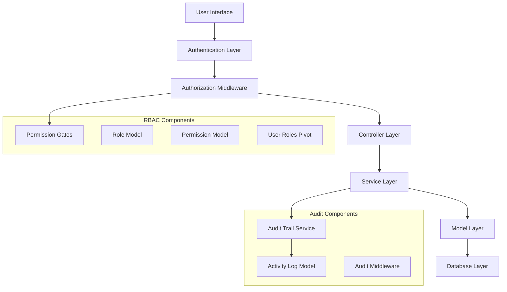

# Design Document

## Overview

This design document outlines the technical implementation approach for the Role-Based Access Control (RBAC) system and Activity Logs/Audit Trail functionality. The solution leverages Laravel's built-in authorization features combined with the Spatie Permission package for robust role management and a custom audit trail system for comprehensive activity logging.

## Architecture

### High-Level Architecture



### Technology Stack

- **Framework**: Laravel 12.x
- **Permission Management**: Spatie Laravel-Permission package
- **Database**: MySQL/SQLite with proper indexing
- **Frontend**: Inertia.js with React
- **Middleware**: Custom audit and permission middleware
- **Logging**: Laravel's built-in logging with custom channels

## Components and Interfaces

### 1. Role Management System

#### Roles and Permissions Structure
```php
// Roles
- super_admin (existing)
- pharmacy_admin (existing, renamed from admin)
- pharmacist (new)
- cashier (new)

// Permissions
- manage_users
- manage_medicines
- manage_customers
- manage_suppliers
- process_sales
- view_reports
- manage_settings
- export_data
- view_audit_logs
```

#### Permission Matrix
| Role | Users | Medicines | Customers | Suppliers | Sales | Reports | Settings | Audit |
|------|-------|-----------|-----------|-----------|-------|---------|----------|-------|
| Super Admin | ✓ | ✓ | ✓ | ✓ | ✓ | ✓ | ✓ | ✓ |
| Pharmacy Admin | ✓ | ✓ | ✓ | ✓ | ✓ | ✓ | ✓ | ✓ |
| Pharmacist | ✗ | ✓ | ✓ | ✓ | ✓ | ✓ | ✗ | ✗ |
| Cashier | ✗ | View Only | ✓ | ✗ | ✓ | Basic | ✗ | ✗ |

### 2. Database Schema

#### New Tables
```sql
-- Spatie Permission Tables (auto-generated)
roles
permissions
model_has_permissions
model_has_roles
role_has_permissions

-- Custom Audit Trail Table
activity_logs (
    id BIGINT PRIMARY KEY,
    user_id BIGINT,
    pharmacy_id BIGINT,
    subject_type VARCHAR(255),
    subject_id BIGINT,
    event VARCHAR(255),
    properties JSON,
    old_values JSON,
    new_values JSON,
    ip_address VARCHAR(45),
    user_agent TEXT,
    created_at TIMESTAMP,
    updated_at TIMESTAMP,
    INDEX idx_user_pharmacy (user_id, pharmacy_id),
    INDEX idx_subject (subject_type, subject_id),
    INDEX idx_event_date (event, created_at)
)
```

#### Modified Tables
```sql
-- Add audit fields to existing models
ALTER TABLE medicines ADD COLUMN created_by BIGINT;
ALTER TABLE medicines ADD COLUMN updated_by BIGINT;
ALTER TABLE sales ADD COLUMN created_by BIGINT;
ALTER TABLE customers ADD COLUMN created_by BIGINT;
ALTER TABLE suppliers ADD COLUMN created_by BIGINT;
```

### 3. Middleware Architecture

#### Permission Middleware Stack
```php
// Route Protection Middleware
'auth' -> 'verified' -> 'permission:manage_medicines' -> Controller

// Audit Middleware (applied globally)
'audit.trail' -> captures all model changes
```

#### Custom Middleware Components
- `PermissionMiddleware`: Checks user permissions for routes
- `AuditTrailMiddleware`: Logs all user activities
- `RoleRedirectMiddleware`: Redirects users to appropriate dashboards

### 4. Service Layer Design

#### Permission Service
```php
class PermissionService
{
    public function assignRoleToUser(User $user, string $role): bool
    public function checkUserPermission(User $user, string $permission): bool
    public function getUserPermissions(User $user): Collection
    public function syncUserRoles(User $user, array $roles): void
}
```

#### Audit Trail Service
```php
class AuditTrailService
{
    public function logActivity(string $event, Model $model, array $properties = []): void
    public function getModelHistory(Model $model): Collection
    public function getUserActivities(User $user, array $filters = []): Collection
    public function exportAuditData(array $filters = []): string
}
```

## Data Models

### 1. Enhanced User Model
```php
class User extends Authenticatable
{
    use HasRoles, HasPermissions, Auditable;
    
    // Existing fields plus audit tracking
    protected $fillable = [
        'name', 'email', 'password', 'pharmacy_id', 'role',
        'created_by', 'updated_by'
    ];
    
    // Role checking methods
    public function isSuperAdmin(): bool
    public function isPharmacyAdmin(): bool
    public function isPharmacist(): bool
    public function isCashier(): bool
    
    // Audit methods
    public function activities(): HasMany
    public function createdRecords(): HasMany
}
```

### 2. Activity Log Model
```php
class ActivityLog extends Model
{
    protected $fillable = [
        'user_id', 'pharmacy_id', 'subject_type', 'subject_id',
        'event', 'properties', 'old_values', 'new_values',
        'ip_address', 'user_agent'
    ];
    
    protected $casts = [
        'properties' => 'array',
        'old_values' => 'array',
        'new_values' => 'array'
    ];
    
    // Relationships
    public function user(): BelongsTo
    public function subject(): MorphTo
    public function pharmacy(): BelongsTo
}
```

### 3. Auditable Trait
```php
trait Auditable
{
    protected static function bootAuditable(): void
    {
        static::created(function ($model) {
            app(AuditTrailService::class)->logActivity('created', $model);
        });
        
        static::updated(function ($model) {
            app(AuditTrailService::class)->logActivity('updated', $model);
        });
        
        static::deleted(function ($model) {
            app(AuditTrailService::class)->logActivity('deleted', $model);
        });
    }
}
```

## Error Handling

### Permission Denied Responses
- **Web Routes**: Redirect to 403 error page with role-appropriate message
- **API Routes**: Return JSON response with 403 status and error details
- **AJAX Requests**: Return structured error response for frontend handling

### Audit Trail Error Handling
- **Failed Logging**: Use Laravel's queue system for retry mechanism
- **Database Errors**: Fallback to file-based logging
- **Performance Issues**: Implement async logging for high-traffic operations

### User Experience Considerations
- **Progressive Disclosure**: Show/hide UI elements based on permissions
- **Graceful Degradation**: Provide alternative actions when permissions are insufficient
- **Clear Messaging**: Inform users why certain actions are restricted

## Testing Strategy

### Unit Tests
- **Permission Tests**: Verify role assignments and permission checks
- **Audit Tests**: Ensure all CRUD operations are properly logged
- **Service Tests**: Test permission and audit service methods
- **Model Tests**: Verify relationships and audit trait functionality

### Integration Tests
- **Middleware Tests**: Test permission and audit middleware in request flow
- **Controller Tests**: Verify proper authorization in all endpoints
- **Database Tests**: Ensure audit logs are created and retrievable

### Feature Tests
- **Role-based Navigation**: Test menu visibility for different roles
- **Permission Enforcement**: Test access control across all features
- **Audit Trail Completeness**: Verify all user actions are logged
- **Export Functionality**: Test audit data export in various formats

### Performance Tests
- **Permission Checking**: Ensure minimal overhead for permission checks
- **Audit Logging**: Test performance impact of activity logging
- **Database Queries**: Optimize queries for audit trail retrieval
- **Memory Usage**: Monitor memory consumption with large audit datasets

## Security Considerations

### Permission Security
- **Principle of Least Privilege**: Users get minimum required permissions
- **Permission Caching**: Cache permissions with proper invalidation
- **Session Security**: Regenerate sessions on role changes
- **API Security**: Ensure API endpoints respect permission system

### Audit Trail Security
- **Data Integrity**: Use checksums to prevent audit log tampering
- **Access Control**: Restrict audit log access to authorized users only
- **Data Retention**: Implement automatic cleanup of old audit records
- **Sensitive Data**: Mask or exclude sensitive information from logs

### Multi-tenancy Security
- **Data Isolation**: Ensure users only see their pharmacy's data
- **Cross-tenant Access**: Prevent unauthorized access to other pharmacy data
- **Audit Isolation**: Separate audit logs by pharmacy context
- **Permission Scope**: Limit permissions to user's pharmacy context

## Performance Optimization

### Database Optimization
- **Indexing Strategy**: Optimize indexes for permission and audit queries
- **Query Optimization**: Use eager loading for role and permission relationships
- **Partitioning**: Consider table partitioning for large audit datasets
- **Caching**: Implement Redis caching for frequently accessed permissions

### Application Optimization
- **Permission Caching**: Cache user permissions in session/Redis
- **Lazy Loading**: Load audit data only when requested
- **Batch Operations**: Batch audit log insertions for better performance
- **Background Processing**: Use queues for non-critical audit operations

### Frontend Optimization
- **Permission-based Rendering**: Only render components user can access
- **Lazy Loading**: Load audit history on demand
- **Pagination**: Implement efficient pagination for audit logs
- **Caching**: Cache permission states in frontend application state