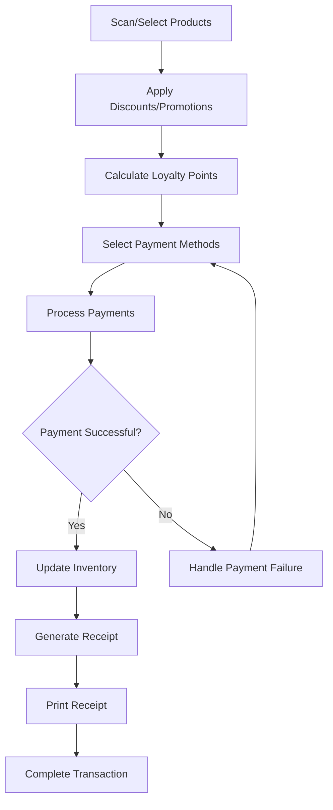
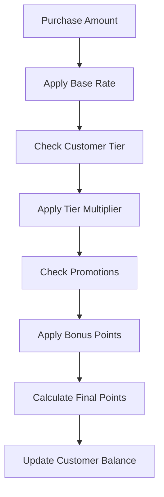
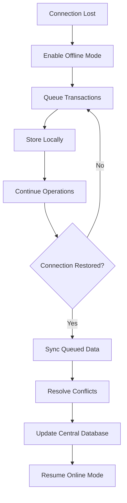

# Sales & POS System - System Design

## 🏗️ Architecture Overview

### System Components
```
┌─────────────────┐    ┌─────────────────┐    ┌─────────────────┐
│   POS Frontend  │    │  Laravel API    │    │   Database      │
│                 │    │                 │    │                 │
│ • Touch UI      │◄──►│ • Controllers   │◄──►│ • Enhanced      │
│ • Cart Mgmt     │    │ • Services      │    │   Sales Schema  │
│ • Payment       │    │ • Jobs/Queues   │    │ • Loyalty       │
│ • Offline Mode  │    │                 │    │ • Promotions    │
└─────────────────┘    └─────────────────┘    └─────────────────┘
         │                       │                       │
         │              ┌─────────────────┐              │
         │              │  External APIs  │              │
         └──────────────►│                 │◄─────────────┘
                        │ • Payment Gateways
                        │ • Mobile Money  │
                        │ • Insurance APIs│
                        │ • Printer Drivers
                        └─────────────────┘
```

## 📊 Database Schema Design

### Enhanced Sales Tables
```sql
-- Enhanced sales table
ALTER TABLE sales ADD COLUMN (
    -- Transaction Details
    transaction_id VARCHAR(255) UNIQUE,
    pos_terminal_id VARCHAR(50),
    cashier_id BIGINT,
    
    -- Customer & Loyalty
    customer_id BIGINT NULL,
    loyalty_points_earned INT DEFAULT 0,
    loyalty_points_redeemed INT DEFAULT 0,
    
    -- Payment Details
    payment_methods JSON, -- Multiple payment methods
    payment_status ENUM('pending', 'completed', 'failed', 'refunded'),
    
    -- Discounts & Promotions
    subtotal DECIMAL(10,2),
    discount_amount DECIMAL(10,2) DEFAULT 0,
    tax_amount DECIMAL(10,2) DEFAULT 0,
    total_amount DECIMAL(10,2),
    
    -- Profit Tracking
    total_cost DECIMAL(10,2),
    profit_margin DECIMAL(5,2),
    
    -- Receipt & Documentation
    receipt_number VARCHAR(100),
    receipt_printed BOOLEAN DEFAULT FALSE,
    
    -- Status & Timestamps
    sale_type ENUM('pos', 'online', 'phone') DEFAULT 'pos',
    is_offline BOOLEAN DEFAULT FALSE,
    synced_at TIMESTAMP NULL
);
```

### New Tables Structure
```sql
-- Payment transactions
CREATE TABLE payment_transactions (
    id BIGINT PRIMARY KEY AUTO_INCREMENT,
    sale_id BIGINT,
    payment_method ENUM('cash', 'card', 'mobile_money', 'insurance', 'loyalty_points'),
    amount DECIMAL(10,2),
    currency VARCHAR(3) DEFAULT 'USD',
    reference_number VARCHAR(255),
    gateway_response JSON,
    status ENUM('pending', 'completed', 'failed', 'cancelled'),
    processed_at TIMESTAMP NULL,
    created_at TIMESTAMP DEFAULT CURRENT_TIMESTAMP
);

-- Customer loyalty program
CREATE TABLE customer_loyalty (
    id BIGINT PRIMARY KEY AUTO_INCREMENT,
    customer_id BIGINT,
    points_balance INT DEFAULT 0,
    tier ENUM('bronze', 'silver', 'gold', 'platinum') DEFAULT 'bronze',
    tier_progress INT DEFAULT 0,
    lifetime_points INT DEFAULT 0,
    last_activity_date DATE,
    created_at TIMESTAMP DEFAULT CURRENT_TIMESTAMP
);

-- Loyalty transactions
CREATE TABLE loyalty_transactions (
    id BIGINT PRIMARY KEY AUTO_INCREMENT,
    customer_id BIGINT,
    sale_id BIGINT NULL,
    transaction_type ENUM('earned', 'redeemed', 'expired', 'bonus'),
    points INT,
    description TEXT,
    expires_at DATE NULL,
    created_at TIMESTAMP DEFAULT CURRENT_TIMESTAMP
);

-- Promotions and discounts
CREATE TABLE promotions (
    id BIGINT PRIMARY KEY AUTO_INCREMENT,
    name VARCHAR(255),
    description TEXT,
    type ENUM('percentage', 'fixed_amount', 'bogo', 'bulk_discount'),
    value DECIMAL(10,2),
    conditions JSON, -- Minimum amount, quantity, etc.
    applicable_items JSON, -- Specific medicines or categories
    customer_tiers JSON, -- Which loyalty tiers qualify
    start_date DATE,
    end_date DATE,
    usage_limit INT NULL,
    usage_count INT DEFAULT 0,
    is_active BOOLEAN DEFAULT TRUE,
    created_at TIMESTAMP DEFAULT CURRENT_TIMESTAMP
);

-- Coupons
CREATE TABLE coupons (
    id BIGINT PRIMARY KEY AUTO_INCREMENT,
    code VARCHAR(50) UNIQUE,
    promotion_id BIGINT,
    customer_id BIGINT NULL, -- NULL for public coupons
    usage_limit INT DEFAULT 1,
    usage_count INT DEFAULT 0,
    expires_at TIMESTAMP,
    is_active BOOLEAN DEFAULT TRUE,
    created_at TIMESTAMP DEFAULT CURRENT_TIMESTAMP
);

-- Returns and refunds
CREATE TABLE returns (
    id BIGINT PRIMARY KEY AUTO_INCREMENT,
    original_sale_id BIGINT,
    return_number VARCHAR(100) UNIQUE,
    customer_id BIGINT NULL,
    reason ENUM('defective', 'wrong_item', 'customer_request', 'expired'),
    return_type ENUM('full_refund', 'partial_refund', 'exchange', 'credit_note'),
    total_amount DECIMAL(10,2),
    refund_method ENUM('original_payment', 'cash', 'credit_note'),
    status ENUM('pending', 'approved', 'completed', 'rejected'),
    processed_by BIGINT,
    notes TEXT,
    created_at TIMESTAMP DEFAULT CURRENT_TIMESTAMP
);

-- Return items
CREATE TABLE return_items (
    id BIGINT PRIMARY KEY AUTO_INCREMENT,
    return_id BIGINT,
    medicine_id BIGINT,
    batch_id BIGINT NULL,
    quantity INT,
    unit_price DECIMAL(10,2),
    total_price DECIMAL(10,2),
    condition_notes TEXT,
    restocked BOOLEAN DEFAULT FALSE
);

-- POS terminals
CREATE TABLE pos_terminals (
    id BIGINT PRIMARY KEY AUTO_INCREMENT,
    terminal_id VARCHAR(50) UNIQUE,
    name VARCHAR(255),
    location VARCHAR(255),
    warehouse_id BIGINT,
    ip_address VARCHAR(45),
    printer_config JSON,
    cash_drawer_config JSON,
    scanner_config JSON,
    is_active BOOLEAN DEFAULT TRUE,
    last_sync TIMESTAMP NULL,
    created_at TIMESTAMP DEFAULT CURRENT_TIMESTAMP
);

-- Offline transaction queue
CREATE TABLE offline_transactions (
    id BIGINT PRIMARY KEY AUTO_INCREMENT,
    terminal_id VARCHAR(50),
    transaction_data JSON,
    transaction_type ENUM('sale', 'return', 'payment'),
    status ENUM('pending', 'synced', 'failed'),
    sync_attempts INT DEFAULT 0,
    error_message TEXT NULL,
    created_at TIMESTAMP DEFAULT CURRENT_TIMESTAMP,
    synced_at TIMESTAMP NULL
);

-- Receipt templates
CREATE TABLE receipt_templates (
    id BIGINT PRIMARY KEY AUTO_INCREMENT,
    name VARCHAR(255),
    type ENUM('customer', 'pharmacy', 'insurance'),
    template_data JSON,
    is_default BOOLEAN DEFAULT FALSE,
    created_at TIMESTAMP DEFAULT CURRENT_TIMESTAMP
);
```

## 🔧 Service Layer Architecture

### Core Services
```php
// POS Management
POSService
├── TransactionService
├── PaymentService
├── ReceiptService
└── OfflineService

// Customer & Loyalty
LoyaltyService
├── PointsCalculationService
├── TierManagementService
├── RewardsService
└── CustomerService

// Promotions & Discounts
PromotionService
├── DiscountCalculationService
├── CouponService
├── RuleEngineService
└── CampaignService

// Returns & Refunds
ReturnService
├── RefundProcessingService
├── ExchangeService
├── CreditNoteService
└── RestockingService

// Hardware Integration
HardwareService
├── PrinterService
├── ScannerService
├── CashDrawerService
└── PaymentTerminalService
```

## 📱 Frontend Component Structure

### POS Interface Components
```jsx
POSSystem/
├── POSInterface/
│   ├── ProductSearch
│   ├── ShoppingCart
│   ├── CustomerLookup
│   └── QuickActions
├── PaymentProcessing/
│   ├── PaymentMethods
│   ├── PaymentSplit
│   ├── PaymentValidation
│   └── ReceiptPreview
├── CustomerManagement/
│   ├── LoyaltyDisplay
│   ├── PointsRedemption
│   ├── TierBenefits
│   └── CustomerHistory
├── PromotionsInterface/
│   ├── DiscountApplication
│   ├── CouponValidation
│   ├── PromotionDisplay
│   └── BulkDiscounts
└── OfflineMode/
    ├── OfflineIndicator
    ├── SyncStatus
    ├── QueuedTransactions
    └── ConflictResolution
```

### Management Dashboard Components
```jsx
POSManagement/
├── SalesAnalytics/
│   ├── RealTimeSales
│   ├── ProfitMargins
│   ├── PaymentMethods
│   └── PerformanceMetrics
├── LoyaltyManagement/
│   ├── CustomerTiers
│   ├── PointsOverview
│   ├── RewardsProgram
│   └── LoyaltyAnalytics
├── PromotionManagement/
│   ├── ActivePromotions
│   ├── CouponGeneration
│   ├── CampaignPerformance
│   └── DiscountRules
└── ReturnManagement/
    ├── ReturnRequests
    ├── RefundProcessing
    ├── ExchangeHandling
    └── RestockingQueue
```

## 🔄 Business Logic Flow

### POS Transaction Process


### Loyalty Points Calculation


### Offline Mode Workflow


## 🔐 Security and Compliance

### PCI DSS Compliance
- Encrypted card data transmission
- Secure payment processing
- Regular security audits
- Access control and monitoring
- Secure key management

### Data Protection
- Customer data encryption
- Transaction audit trails
- Secure API communications
- Role-based access control
- GDPR compliance features

## 📊 Performance Optimization

### Database Optimization
- Indexed transaction tables
- Partitioned sales data by date
- Optimized loyalty queries
- Cached promotion rules
- Efficient offline sync queries

### Caching Strategy
```php
// Performance Caching
- Product data: 1 hour
- Customer loyalty: 30 minutes
- Active promotions: 15 minutes
- Payment methods: 4 hours
- Receipt templates: 24 hours
```

### Hardware Integration
- Asynchronous printer communication
- Cached scanner configurations
- Optimized payment terminal protocols
- Efficient cash drawer management
- Real-time hardware status monitoring

## 🔌 Integration Architecture

### Payment Gateway Integration
```php
PaymentGateway/
├── CashPayment
├── CardPayment (Stripe, Square)
├── MobileMoneyPayment (M-Pesa, Airtel)
├── InsurancePayment
└── LoyaltyPointsPayment
```

### Hardware Integration
```php
HardwareIntegration/
├── ThermalPrinter (ESC/POS commands)
├── BarcodeScanner (USB/Bluetooth)
├── CashDrawer (Serial/USB)
├── PaymentTerminal (TCP/IP)
└── CustomerDisplay (Serial/USB)
```

### Third-party APIs
```php
ExternalAPIs/
├── InsuranceProviders
├── MobileMoneyGateways
├── BankingAPIs
├── LoyaltyPartners
└── ReceiptDeliveryServices
```

This comprehensive design provides a robust foundation for a modern, feature-rich POS system that can handle complex pharmacy operations while maintaining excellent performance and user experience.